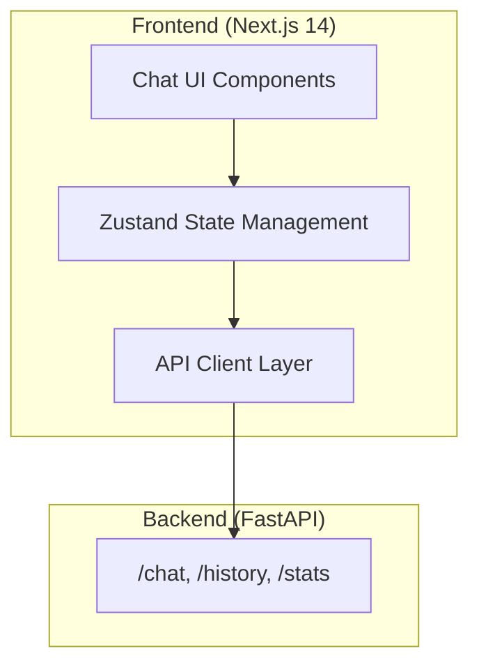
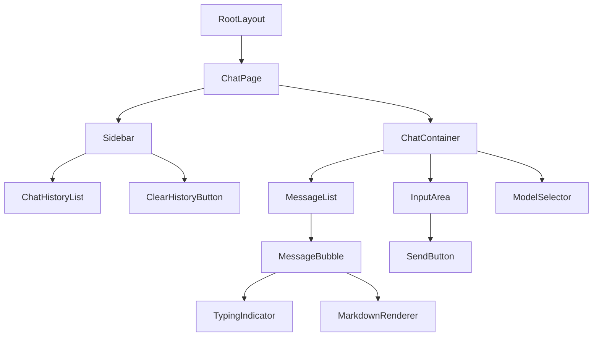

# Design Document: CheapGPT Frontend

## Overview

CheapGPT Frontend je Next.js 14 aplikacija sa App Router-om koja pruža moderno chat sučelje za interakciju sa CheapGPT backend API-jem. Koristi shadcn/ui komponente, Tailwind CSS za styling, i Framer Motion za animacije.

## Architecture



### Tech Stack

- **Framework**: Next.js 14 (App Router)
- **UI Library**: shadcn/ui
- **Styling**: Tailwind CSS
- **Animations**: Framer Motion
- **State Management**: Zustand
- **HTTP Client**: Native fetch with custom wrapper
- **Markdown**: react-markdown + rehype-highlight

## Components and Interfaces

### Component Hierarchy



### Core Interfaces

```typescript
// types/chat.ts
interface Message {
  id: string;
  role: 'user' | 'assistant';
  content: string;
  timestamp: Date;
  isLoading?: boolean;
}

interface ChatState {
  messages: Message[];
  isLoading: boolean;
  error: string | null;
  sidebarOpen: boolean;
}

interface ChatActions {
  sendMessage: (content: string) => Promise<void>;
  loadHistory: () => Promise<void>;
  clearHistory: () => Promise<void>;
  toggleSidebar: () => void;
  clearError: () => void;
}

// API Response types (matching backend)
interface ChatResponse {
  user_message: string;
  ai_response: string;
  timestamp: string;
}

interface HistoryItem {
  id: number;
  user_message: string;
  ai_response: string;
  timestamp: string;
}

interface ModelOption {
  id: string;
  name: string;
  provider: string;
  available: boolean;
}
```

### Component Specifications

#### ChatContainer
- Main wrapper component
- Manages scroll behavior
- Coordinates message display and input

#### MessageBubble
- Props: `message: Message`, `isLast: boolean`
- Renders user/assistant messages differently
- Includes Framer Motion animations
- Renders markdown for AI responses

#### InputArea
- Controlled textarea with auto-resize
- Send on Enter (Shift+Enter for newline)
- Disabled state during loading
- Character limit indicator (optional)

#### ModelSelector
- Fixed position at bottom
- Dropdown with model options
- "Coming Soon" badge for unavailable models
- Tooltip on hover for disabled options

#### Sidebar
- Collapsible on mobile
- Shows recent chat sessions
- Clear history button with confirmation

## Data Models

### Zustand Store

```typescript
// store/chat-store.ts
interface ChatStore extends ChatState, ChatActions {}

const useChatStore = create<ChatStore>((set, get) => ({
  messages: [],
  isLoading: false,
  error: null,
  sidebarOpen: true,
  
  sendMessage: async (content) => {
    // Implementation
  },
  
  loadHistory: async () => {
    // Implementation
  },
  
  clearHistory: async () => {
    // Implementation
  },
  
  toggleSidebar: () => {
    set((state) => ({ sidebarOpen: !state.sidebarOpen }));
  },
  
  clearError: () => {
    set({ error: null });
  },
}));
```

### API Client

```typescript
// lib/api.ts
const API_BASE = process.env.NEXT_PUBLIC_API_URL || 'http://localhost:8000';

export const chatApi = {
  sendMessage: async (message: string): Promise<ChatResponse> => {
    const response = await fetch(`${API_BASE}/chat`, {
      method: 'POST',
      headers: { 'Content-Type': 'application/json' },
      body: JSON.stringify({ message }),
    });
    if (!response.ok) throw new Error('Failed to send message');
    return response.json();
  },
  
  getHistory: async (limit = 20): Promise<HistoryItem[]> => {
    const response = await fetch(`${API_BASE}/history?limit=${limit}`);
    if (!response.ok) throw new Error('Failed to fetch history');
    return response.json();
  },
  
  clearHistory: async (): Promise<void> => {
    const response = await fetch(`${API_BASE}/history`, { method: 'DELETE' });
    if (!response.ok) throw new Error('Failed to clear history');
  },
};
```


## Correctness Properties

*A property is a characteristic or behavior that should hold true across all valid executions of a system—essentially, a formal statement about what the system should do. Properties serve as the bridge between human-readable specifications and machine-verifiable correctness guarantees.*

### Property 1: Message Send Flow Integrity

*For any* non-empty message string, when sendMessage is called:
1. The message should be added to the messages array with role 'user'
2. isLoading should become true
3. After API response, a message with role 'assistant' should be added
4. isLoading should become false

**Validates: Requirements 1.1, 1.2, 1.3**

### Property 2: Empty Message Rejection

*For any* string that is empty or contains only whitespace characters, attempting to send it should:
1. Not add any message to the messages array
2. Not trigger any API call
3. Leave the state unchanged

**Validates: Requirements 1.4**

### Property 3: Message Chronological Order Invariant

*For any* messages array in the chat state, messages should be ordered by timestamp in ascending order (oldest first, newest last).

**Validates: Requirements 1.5**

### Property 4: History Rendering Completeness

*For any* array of history items returned from the API, the sidebar should render exactly that many items, each containing the user_message content.

**Validates: Requirements 3.2**

### Property 5: Error State on API Failure

*For any* API call that fails (network error, timeout, or non-2xx response), the error state should be set to a non-null error message, and isLoading should be false.

**Validates: Requirements 3.4, 6.1, 6.2**

### Property 6: Message Preservation on Send Error

*For any* message that fails to send due to API error, the original message content should remain available for retry (not lost from the input or state).

**Validates: Requirements 6.3**

## Error Handling

### Network Errors
- Catch fetch errors and set error state with user-friendly message
- Display toast notification using shadcn/ui Toast component
- Preserve user input on send failure

### API Errors
- Handle non-2xx responses by parsing error message from response
- Display specific error messages when available
- Generic fallback message for unknown errors

### Timeout Handling
- Implement AbortController with 30-second timeout
- Show timeout-specific error message
- Allow user to retry

### Error Recovery
- Clear error state on successful subsequent request
- Provide "Retry" button for failed operations
- Auto-dismiss error toasts after 5 seconds

## Testing Strategy

### Unit Tests
Unit tests will verify specific examples and edge cases:

- InputArea component renders correctly
- MessageBubble displays user vs assistant messages differently
- ModelSelector shows "Coming Soon" badge
- Sidebar toggle works correctly
- Markdown rendering for code blocks, lists, bold text
- Empty message validation
- Error toast display

### Property-Based Tests
Property-based tests will use **fast-check** library to verify universal properties:

- **Minimum 100 iterations per property test**
- Each test tagged with: `Feature: cheapgpt-frontend, Property N: [property text]`

Properties to test:
1. Message send flow integrity (state transitions)
2. Empty/whitespace message rejection
3. Message chronological ordering invariant
4. History rendering completeness
5. Error state on API failure
6. Message preservation on error

### Integration Tests
- Full chat flow: send message → receive response → display
- History load on mount
- Clear history flow
- Error recovery scenarios

### Test Configuration
```typescript
// vitest.config.ts
export default defineConfig({
  test: {
    environment: 'jsdom',
    setupFiles: ['./src/test/setup.ts'],
    coverage: {
      reporter: ['text', 'html'],
      exclude: ['node_modules/', 'src/test/'],
    },
  },
});
```
